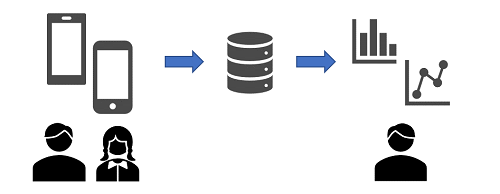
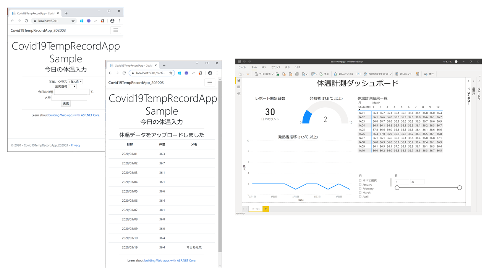

# Covid19 Temperature Recoding App Sample (Responsive Web)

Recording App (Responsive Web) Sample for recording body temperature and report to school, office, etc by pc and smartphone.

Teachers, managers (or anyone who needs report) could get overview using Microsoft Power BI or other reporting tools.




## Solution

- Responsive (PC and smartphone capable) Web app to recording your body temperature (and memo) everyday instead of pen and paper.
    - Developed on ASP.NET Core 3.1 Razor (C#)
    - Uploads single record, date from current datetime and your input(temperature and memo), and shows your past records.

- Sample Power BI Dashboard
    - Provides at-a-glance dashboard from all uploaded data.




## Requrements

- Azure Storage (will use Table storage): get connection string.
- Azure App Service plan to deploy (or other ASP.NET Core 3.1-capable web app server)

## How to use

Update [appsettings.Development.json](Covid19TempRecordApp_202003/appsettings.Development.json) with your configration;

```appsettings.Development.json
  "StorageConnectionString": "YOUR_APP_STORAGE_CONNECTION_STRING"
```

When deply to Azure, make sure to publish this local setting.

## Limitation

For sample and demo reason, any authentication assembled yet.

Please refer [docs.microsoft.com for Identity on ASP.NET Core](https://docs.microsoft.com/en-us/aspnet/core/security/authentication/identity?view=aspnetcore-3.1&tabs=visual-studio)